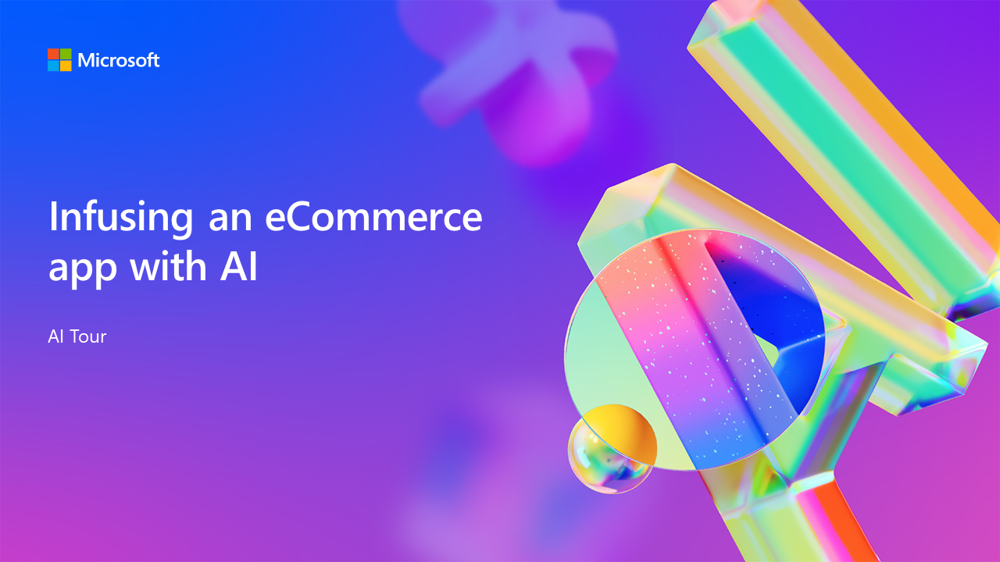

# Infusing an eCommerce app with AI

This repo is a companion to this session at Microsoft AI Tour, a worldwide tour of events.

## Session Description

In this session we will explore how to enhance an eCommerce application using AI. We will start by introducing the eShopLite application, a frontend app built with Blazor and a backend app with .NET API. Our goal is to implement a search feature that uses AI to enable a natural language search experience for users.

In this session, we will dive into the building process, providing an overview of AI models and introducing Semantic Kernel as the key component to connect everything. We will add AI services to the main app, explain the main changes, and run the BackEnd to test the smart search functionality.

Finally, we will review and explain the main concepts covered in the session, including Semantic Kernel, the deployed models, and Prompty, with an optional Q&A session to address any questions from the audience.

## Learning Outcomes

- Understand the integration of LLM-based AI into new or existing applications using .NET and Azure AI Services.
- Learn the tools, libraries, and best practices for incorporating LLMs into intelligent applications.
- Gain practical experience with Prompty.

## Technology Used

The technologies used in the session are:

- Blazor: Used for the frontend application.
- .NET API: Used for the backend application.
- AI Models: GPT-4o and Ada002 for embeddings.
- Semantic Kernel: Key component to connect everything.
- Prompty: Used for search functionality.
- Visual Studio Code: Used for Prompty usage and lifecycle.
- Aspire: Used for analysis and demo details.

## Session Resources

Check the following materials to know more about this session.

| Resources          | Links                             | Description        |
|:-------------------|:----------------------------------|:-------------------|
| Session Delivery Resources | [Main](./session-delivery-resources/README.md) | The main goal of the document is to outline the necessary steps and requirements to run the session. Also including links to the session recordings and session slides.|
| Session Delivery Resources | [Requirements and Preparation](./session-delivery-resources/RequirementsAndPreparation.md) | The main goal of the document is to outline the necessary steps and requirements for running the demo session in both Windows and CodeSpaces environments, including setting up the environment, accessing GPT and ADA models, and preparing the source code. |
| Session Delivery Resources | [Demo steps using Visual Studio 2022](./session-delivery-resources/step-by-step-vs2022.md) | The main goal of the document is to provide a detailed guide for setting up and running the demo project using Visual Studio 2022, including implementing AI search with Semantic Kernel and improving the response message.  |
| Session Delivery Resources | [Demo Steps using CodeSpaces](./session-delivery-resources/step-by-step-codespaces.md) | The main goal of the document is to provide a detailed guide for setting up and running the demo project using GitHub Codespaces, including implementing AI search with Semantic Kernel and improving the response message. |

## Additional Resources and Continued Learning

| Resources          | Links                             | Description        |
|:-------------------|:----------------------------------|:-------------------|
| Develop AI agents using Azure OpenAI and the Semantic Kernel SDK  | [Learning Path](https://learn.microsoft.com/en-us/training/paths/develop-ai-agents-azure-open-ai-semantic-kernel-sdk/) | Learn how to use the Semantic Kernel SDK to build intelligent applications that automate tasks and perform natural language processing. |
| Develop Generative AI solutions with Azure OpenAI Service | [Learning Path](https://learn.microsoft.com/en-us/training/paths/develop-ai-solutions-azure-openai/) | Azure OpenAI Service provides access to OpenAI's powerful large language models such as ChatGPT, GPT, Codex, and Embeddings models. These models enable various natural language processing (NLP) solutions to understand, converse, and generate content. Users can access the service through REST APIs, SDKs, and Azure OpenAI Studio. |

## Content Owners

<!-- ALL-CONTRIBUTORS-LIST:START - Do not remove or modify this section -->

<table>
<tr>
    <td align="center"><a href="http://learnanalytics.microsoft.com">
         
        <b>Bruno Capuano
</b></a> 
            <a href="https://github.com/elbruno" title="talk">📢</a> 
    </td>
</tr></table>

<!-- ALL-CONTRIBUTORS-LIST:END -->

## Responsible AI

Microsoft is committed to helping our customers use our AI products responsibly, sharing our learnings, and building trust-based partnerships through tools like Transparency Notes and Impact Assessments. Many of these resources can be found at [https://aka.ms/RAI](https://aka.ms/RAI).
Microsoft’s approach to responsible AI is grounded in our AI principles of fairness, reliability and safety, privacy and security, inclusiveness, transparency, and accountability.

Large-scale natural language, image, and speech models - like the ones used in this sample - can potentially behave in ways that are unfair, unreliable, or offensive, in turn causing harms. Please consult the [Azure OpenAI service Transparency note](https://learn.microsoft.com/legal/cognitive-services/openai/transparency-note?tabs=text) to be informed about risks and limitations.

The recommended approach to mitigating these risks is to include a safety system in your architecture that can detect and prevent harmful behavior. [Azure AI Content Safety](https://learn.microsoft.com/azure/ai-services/content-safety/overview) provides an independent layer of protection, able to detect harmful user-generated and AI-generated content in applications and services. Azure AI Content Safety includes text and image APIs that allow you to detect material that is harmful. We also have an interactive Content Safety Studio that allows you to view, explore and try out sample code for detecting harmful content across different modalities. The following [quickstart documentation](https://learn.microsoft.com/azure/ai-services/content-safety/quickstart-text?tabs=visual-studio%2Clinux&pivots=programming-language-rest) guides you through making requests to the service.

Another aspect to take into account is the overall application performance. With multi-modal and multi-models applications, we consider performance to mean that the system performs as you and your users expect, including not generating harmful outputs. It's important to assess the performance of your overall application using [generation quality and risk and safety metrics](https://learn.microsoft.com/azure/ai-studio/concepts/evaluation-metrics-built-in).

You can evaluate your AI application in your development environment using the [prompt flow SDK](https://microsoft.github.io/promptflow/index.html). Given either a test dataset or a target, your generative AI application generations are quantitatively measured with built-in evaluators or custom evaluators of your choice. To get started with the prompt flow sdk to evaluate your system, you can follow the [quickstart guide](https://learn.microsoft.com/azure/ai-studio/how-to/develop/flow-evaluate-sdk). Once you execute an evaluation run, you can [visualize the results in Azure AI Studio](https://learn.microsoft.com/azure/ai-studio/how-to/evaluate-flow-results).
